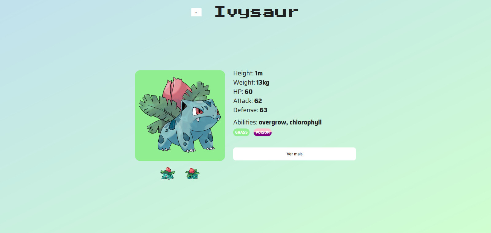

# Pokedex

<div style="display: inline_block">
    
    
    
</div>
<br>

## Table of Contents

- [Introduction](#introduction)
- [Demo](#demo)
- [Setup Instructions](#setup-instructions)
- [How did I decide which technologies to use](#how-did-i-decide-which-technologies-to-use)
- [Are there any improvements I could make to my submission](#are-there-any-improvements-i-could-make-to-my-submission)
- [What would I do differently if I was allocated more time](#what-would-i-do-differently-if-i-was-allocated-more-time)

## Introduction

This is a pokedex application for the [Front-End challenge - Graphql API SpaceX](https://github.com/dantas-dev/front-challenge-spacex) made with [VueJS](https://vuejs.org/), [Typescript](https://www.typescriptlang.org/) and [Vite](https://vitejs.dev/).

## Demo

<div style="display: inline_block"><br>
    
    
</div>
<div style="display: inline_block"><br>
    
    
</div>
<br>

## Setup instructions

1. Install [NodeJS](https://nodejs.org/pt) and [NPM](https://www.npmjs) or [Yarn](https://classic.yarnpkg.com/lang/en/docs/install/#debian-stable).

2. Clone this [repository](https://github.com/danvinicius/front-challenge-spacex).
    ```bash
    git clone git@github.com:danvinicius/front-challenge-spacex.git
    ```
3. Go to root folder and install dependencies with [yarn](https://classic.yarnpkg.com/lang/en/docs/install/#debian-stable) or [NPM](https://www.npmjs.com/)
    ```bash
    yarn install
    ```
    or

    ```bash
    npm run install
    ```
4. Start the application in development mode
    ```bash
    yarn dev
    ```

    or

    ```bash
    npm run dev
    ```
5. The application will be accessible at http://localhost:5173

## How did I decide which technologies to use

I've decided to use VueJS with Typescript due to my experience with this framework and this language, so I could do it faster. I decided to use Vite because it speeds up the development.

## Are there any improvements I could make to my submission

I would try to get some 'watch's out of the code and try the request results observation another way. Also, I would try to write less HTML and automate some repetitive tags like \<p> on Pokemon details.

## What would I do differently if I was allocated more time

I would search for a more descriptive public API, with more text information to fill the empty space better. I also would create a search component to filter pokemons by their names.
