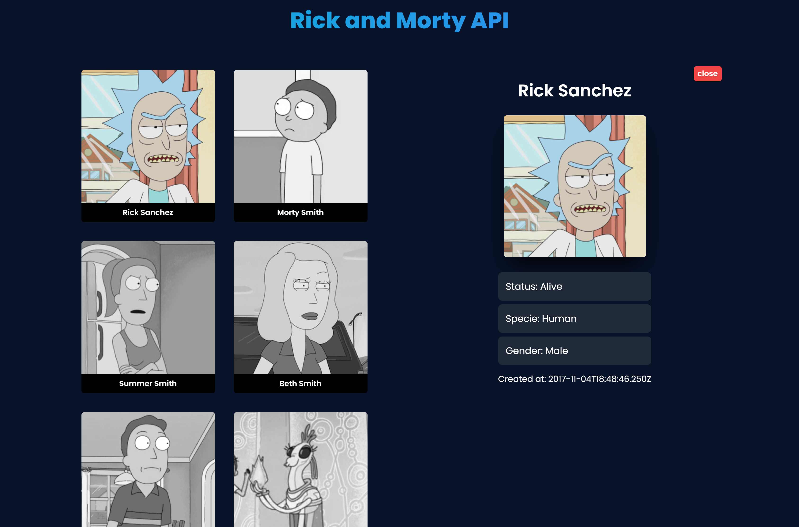

# 🚀 SolarMarket Front-end Challenge



## Challenge concluded
DESAFIO: [AQUI](https://github.com/luanrramos/front-challenge-spacex/blob/JR-luanramos/challenge.md)      
DEPLOY ONLINE: [rickandmorty.luanramos.com.br/](https://rickandmorty.luanramos.com.br/)  
INSTRUÇÕES: [AQUI](https://github.com/luanrramos/front-challenge-spacex/blob/JR-luanramos/INSTRUCTIONS.md)      

## Technologies

- [React](https://legacy.reactjs.org/)
- [TypeScript](https://www.typescriptlang.org/)
- [GraphQL](https://graphql.org/)
- [Apollo Client](https://www.apollographql.com/docs/)
- [Jest](https://jestjs.io/)
- [React Testing Library](https://testing-library.com/docs/react-testing-library/intro)
- [Tailwind](https://tailwindcss.com/docs/)
- [Eslint](https://eslint.org/)
- [Babel](https://babeljs.io/)


## Setup instructions

1. Download zip code


2. Install npm packages

```bash
npm install
```

Done! You just installed! Let's run it.

### Running application

1. Run on terminal this command:

```bash
npm run dev 
```

2. The service will show the link to you access this application

## Running tests

1. Run on terminal this command:

```bash
npm test
```

## Q.A

1. How did you decide which technologies to use as part of your solution 

- I utilized React to build a component-based application, enabling modularization and scalability.

- I employed Jest and React Testing Library to design and execute simple unit tests, ensuring components were fully developed before implementation.

2. Are there any improvements you could make to your submission

- I could enhance the UI Design of the cards by organizing the layout more effectively. While the current user experience is satisfactory, these changes could lead to significant improvements.

3. What would you do differently if you were allocated more time

I would sharpen the layout to help on the scalability of the project. Also, the Rick and Morty SpaceX API is pretty impressive, with a lot of data, so theres almost infinite ways to add new features. With a lot of data using characters ID.

Development-wise, i would focus on learning better practices of GraphQL, since i've never used it professionally.
