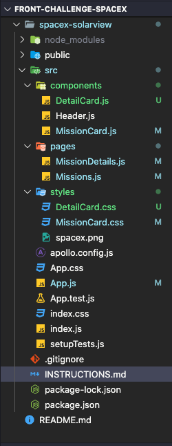
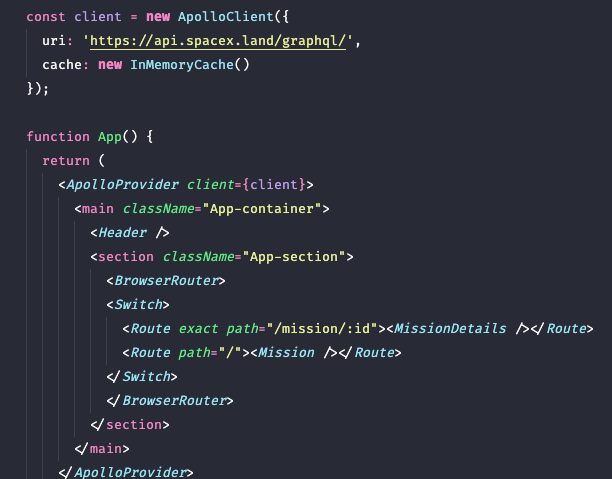

# SolarView - SpaceX Challenge

## SETUP INSTRUCTIONS

### Before start:

1. Clone the repository
  * `git clone git@github.com:Gui-Alucard/front-challenge-spacex.git`.
  * Go to the cloned project directory:
    * `cd spacex-solarview`

2. IF NECESSARY: Install dev dependencies and go to Starting
  * To install the dependencies, run:
    * `npm install`

### Starting

In the project directory, you can run:

#### `npm start`

Runs the app in the development mode. 
Open [http://localhost:3000](http://localhost:3000) to view it in the browser.

The page will reload if you make edits. 
You will also see any lint errors in the console.

---
## About the Code
---

#### 1. Here is my Work Space on VSCode
  * I like to create different folders as you can see.
  

#### 2. Here is how I am using Apollo's Client and the BrowserRouter
  * usually with a unique end-point.
  * routing the main page and mission detail.
  

#### 3. Here is how I am using the GraphQL madeed query
  * I tried use the query `find` but it seems to be some problem returning a empty array
  * That make me use filter's and map's HOF at MissionDetails.js
  

#### 4. No less important, pallete color for this project

### Technologies

 - I decided to use React and Apollo following the official documentation of GraphQL 
 plus, it is my most familiar Technologies!

### Are there any improvements

 - Code refactoring is always a learning opportunity and that’s something I don’t refuse.
  * I am looking forward to working with programming and always open to learning new technologies 
  as was the case with this recent GraphQL.

### What would I do differently

 - I would probably add RTL tests and instead of adding external links to videos, 
 I would incorporate it into the site.
